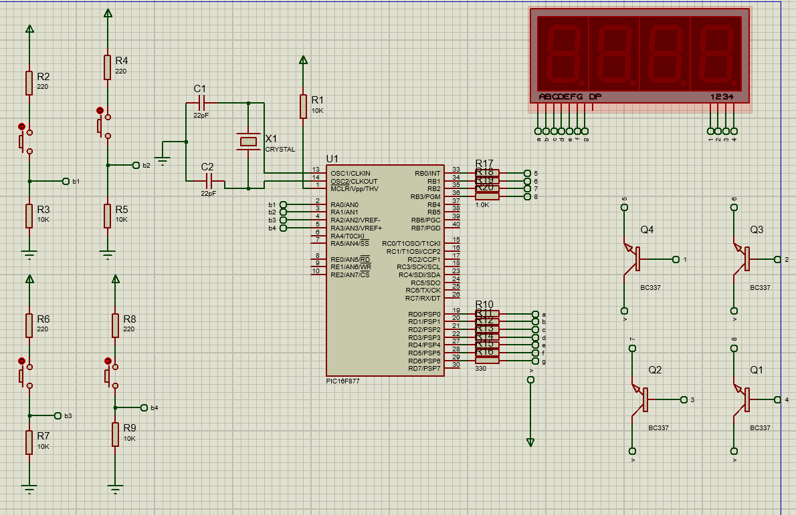
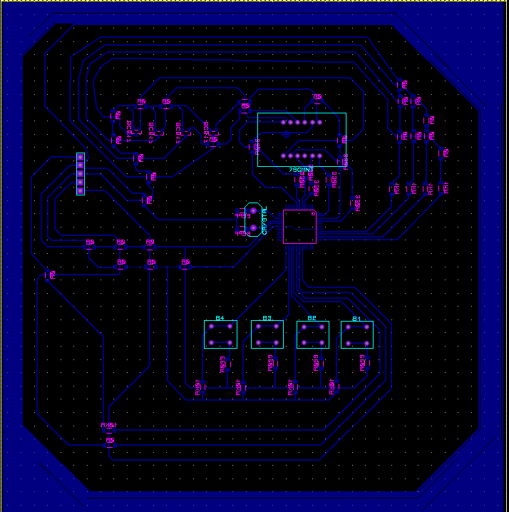
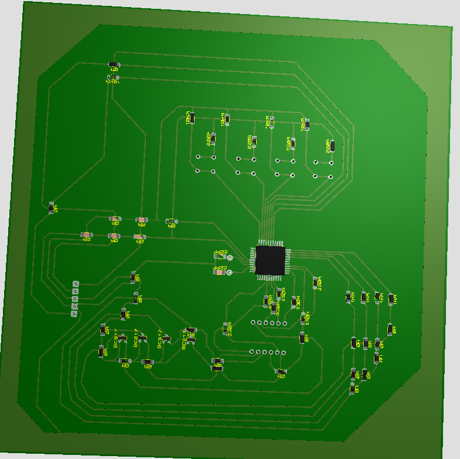

# 4 Digit 7 Segment
In this repo, I made 4 Digit 7 Segment counter with C language. Also schematic and pcb design developed in Proteus.

In the circuit a pic18f4620 microcontroller has been used. The input voltage is 5V. However, with a regularizer it can be higher.

The schematic of the circuit is:

In circuit, 4 buttons are used. Every button controls a different digit. They connected to A ports so I can use A port interrupt and control the 7 Segment.

7 segment pin's are connected to D ports because it is easy to control it. Output of Segment is connected to B ports with transistors. It makes circuit stable.

After developed schematic, I designed PCB design of the circuit.

In PCB design I used T-20 width wire. The connections are far enough not short circuit. Also there are many 0R resistors used because of conflict problem.

Crystal should be close to pic controller. Buttons designed by me, there is no button package in Proteus. The distance between button pins are 2.54mm. Also 7 segment designed by me.

You can check PCB Design in this picture:

Also you can check PCB 3D Visualize in here:

I hope you enjoyed while reading my project. You can always reach me from doyaneren@gmail.com!
